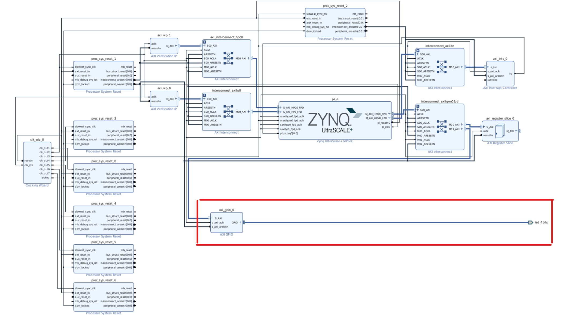
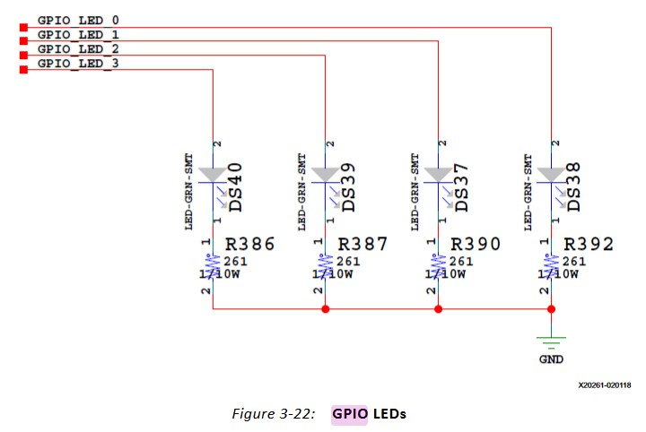
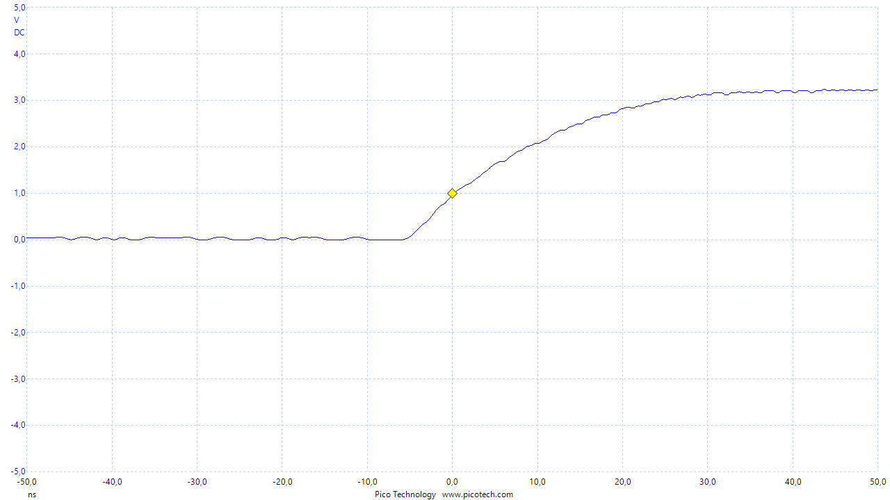
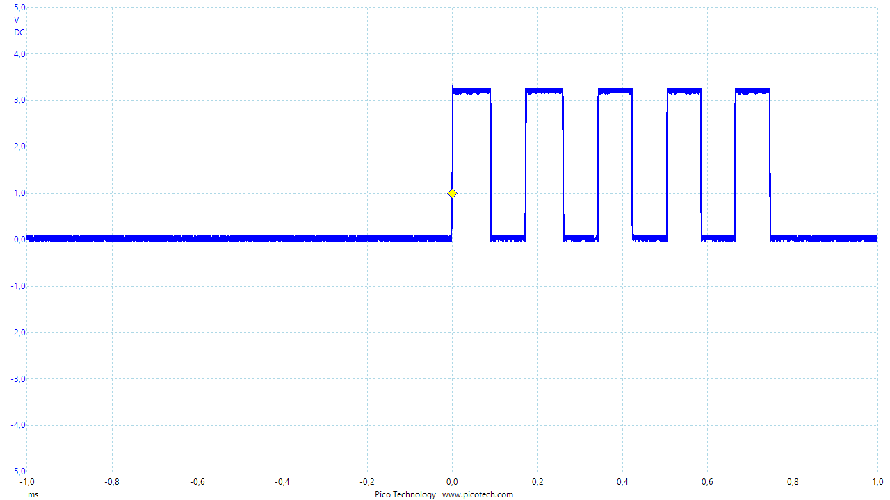

# GPIO Trigger

The prebuild image burned on the SD card does not allow easy access to the GPIO pins. To enable this, the whole image has to be rebuild with [This](https://github.com/Xilinx/Vitis-Tutorials/tree/2021.2/Vitis_Platform_Creation/Introduction/02-Edge-AI-ZCU104) tutorial guiding through the steps. [This](https://www.youtube.com/watch?v=CHsidFIXUEE) youtube video helps understanding the steps to add GPIO pins.

## Setup

### Design Flow

The idea of the setup is to modify the base image given by Xilinx to enable the LEDs (easier than the PMOD gpios). 

1. Download this [image](https://www.xilinx.com/support/download/index.html/content/xilinx/en/downloadNav/embedded-platforms/2021-2.html). In the **hw** folder will be the **hw.xsa** file which can be opened with vitis through the **open_hw_platform** command in the TCL console. 

This block diagram should appear :




2. Adding the LEDs is as simple as adding a AXI_GPIO and connecting it to the AXI Interconnect "interconnect_axihpm0fdp" (in red on the previous picture).
To link the signals to the physical pins of the FPGA, the following **constrain.xdc** file must be created. This file can be found in the [platform_files](./platform_files) folder.

Before exporting the platform, you have to remove any file which would be produced into the "Utility Sources".

3. Exporting the platform will produce the [zcu104_custom.xsa](./platform_files/) file.


### ERRORS you might encounter

Using an earlier version of the Vitis environment (prior to 2022.1), you **WILL** have to apply this [patch](https://support.xilinx.com/s/article/76960?language=en_US) for the IP checker to work properly. 

**step 2 :** you might want to build the petalinux software offline. [This](https://support.xilinx.com/s/article/2021-1-PetaLinux?language=en_US) post guides you through the process.

**step 4 :** During the build of the Vitis project (step 4-4) you might encounter these problems:
- **source file does not exist** : [this](https://support.xilinx.com/s/question/0D52E00006hpRgHSAU/vitis-ide-error-v-60602-source-file-does-not-exist?language=en_US) post should fix it by changing the path to the default boards.
- opencv2 not found : Download the base image for the zcu104 [here](https://www.xilinx.com/support/download/index.html/content/xilinx/en/downloadNav/embedded-platforms/2021-2.html) in which can be found the proper version of opencv. Provide it to the Vitis environement (explanation [here](https://support.xilinx.com/s/question/0D52E00006hpPCUSA2/vitis-vision-libraries-error-on-build?language=en_US)). The default installation path for opencv2 is **petalinux_sdk_2021.2/sysroots/cortexa72-cortexa53-xilinx-linux/usr/local/include/opencv4** for the Includes and  **petalinux_sdk_2021.2/sysroots/cortexa72-cortexa53-xilinx-linux/usr/local/lib** for the Library references.

## Use 

The use of the GPIOs under embedded linux environment is  explained in [this](https://xilinx-wiki.atlassian.net/wiki/spaces/A/pages/18842398/Linux+GPIO+Driver) tutorial.

The GPIO used for the trigger is the 4th LED (DS40) which corresponds to the GPIO511 file. To enable the pin run these commands on the board :
```sh
echo 511 > /sys/class/gpio/export
echo out > /sys/class/gpio/gpio511/direction
```

To light up the LED :
```sh
echo 1 >  /sys/class/gpio/gpio511/value
```

to turn it off :
```sh
echo 0 >  /sys/class/gpio/gpio511/value
```

And to disable it :
```sh
echo 511 > /sys/class/gpio/unexport
```

After inspection of the electrical diagramm of the evaluation board, a tiny wire was soldered to the anode of the DS40 LED in order to access the trigger signal.

<div align="center">

<h4>Electrical diagram from the UG1267 documentation</h4>
</div>


## Benchmark

Using a picoscope, Rise time and max frequency of the trigger was measured at **18 ns** and **5.8 kHz** respectivelly.


