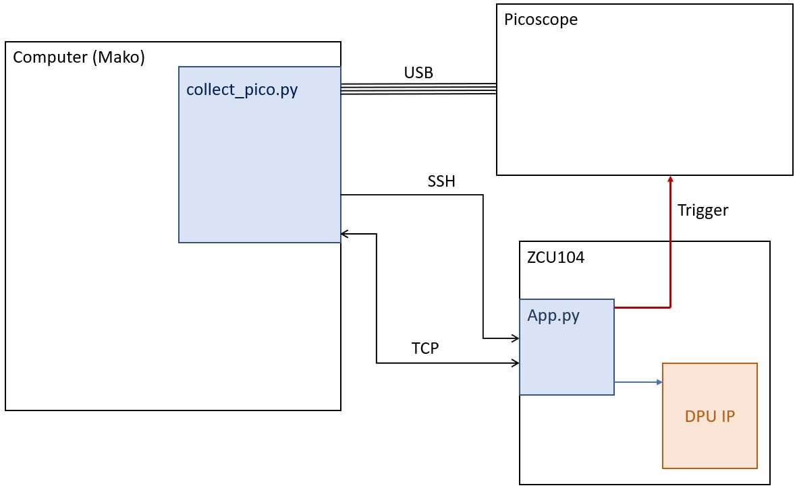

# Master_thesis

This folder will group all the ressources needed to replicate the attacks performed during my master's thesis at the University of Radboud (Nijmegen). This thesis will end my 3-year-long journey at the Ecole Centrale de Lyon (Ecully).

<div align="center">

</div>

The preliminary report written to introduce the subject to my supervisors at ECL can be found [here](Preliminary_report.pdf)
The full thesis can be found in the [thesis](thesis) folder.

The main focus of this thesis is to recover hyperparameters and weights of a Neural Network implemented on a Xilinx zcu104 through Side Channel Attacks.

## Setup the Board

[Xilinx Tutorial](https://github.com/Xilinx/Vitis-AI) will walk you through the setup of Vitis AI on the board which allows users to easily run NN on the FPGA.

The embedded CPU will run PetaLinux as RTOS or Bare Metal are not available for the Deep Processing Unit (DPU) IP on this board yet.

Vitis AI has the ability to run any Network which has been developped with [Pytorch](https://github.com/Xilinx/Vitis-AI-Tutorials/blob/1.4/Design_Tutorials/09-mnist_pyt/README.md), Tensorflow or Caffe. Once converted and implemented on the board, [Vitis AI Runtime](https://github.com/Xilinx/Vitis-AI/tree/master/demo/VART) allows the user to controll the execution via python or C++ API.

The image given by Xilinx for the evaluation board does not allow GPIOs access. To enable them, a new image must be build. [GPIO_trigger_setup](./GPIO_trigger_setup.md) will guide you through the process of building the image and explain how to use the GPIOs as a trigger. The modified image allowing DPU use and GPIOs access can be found in the [platform_files](./platform_files) folder


## Setup

The setup is shown on the next Figure. It is described in more details in the thesis.

<div align="center">

</div>

## Recording traces

In order to record traces, several algorithm must be implemented in order to synchronise the collection. The following Figure shows the basic principle of the system. The master coordinator is the collect_pico.py programm running on the Mako computer. This programm is responsible for lanching one of the app.py (through ssh) which runs on the ZCU board and is responsible for the inference of the Neural Network. The inference only occurs when the picoscope is ready and the computer sends a signal to the ZCU board through a TCP message. 
The collect_pico.py programm outputs a TRS file which contains all the traces. Several algorithms have been implemented to convert and process these traces.

<div align="center">

</div>


## Vitis-AI/Simple_CNNs
Most commands cited here must be run in the Vitis-AI environment. Use the following commands inside the Viti-AI folder to enter it.

```sh
./docker_run.sh xilinx/vitis-ai-cpu:latest
conda activate vitis-ai-pytorch
```

The folders inside Simple_CNNs corresponds to different kind of architectures that have been tested. All the folders have the same basic principle which corresponds to the example given by Xilinx to implement the MNIST example through pytorch. This example has been modified so that the network is not trained to save time. They contain all the scripts required to build and compile .xmodel files. 

The architecture of the network implemented is stored in the common.py file of each folder.

The builder.sh script has been create to automatically create the model with pytorch, quantize it and compile it with the Vitis-AI environment. It takes as an argument the folder containing the network to be compiled.
```sh
./builder.sh -f 3_layers
```

### list

The list folder allows to build and compile multiple architectures in one go. The architecture are single convolution layers which parameters are stored in a csv file inside the folder. all the models can the be built with the multi_builder.sh script which compiles all the architectures and store them in the build/compiled_model folder.
```sh
./multi_builder.sh -l 
```

### singleC

This folder contains tools to generate a lot of networks to assess single weight leakage.
To save time, it has been decided not to quantize random models because it takes too much time. The randomness is added by modifying the binary quantized model. This means that the creation of a model takes less than one second which is really efficient.

The generator.py script compiles these models based on an original network which have been quantized. The weights of the model have been identified in the file with a hex compare software. The generator then replaces the weights with random or fixed weights depending on the application.

The file_handler.py script is mandatory to deal with the transfer of the xmodels to the ZCU104 board.

The idea is to launch both the generator.py and file_handler.py to handle models creation and transfer while the collect_pico_weights.py collects the traces.


## pico

This folder contains some tools to record and process traces.

### collect_pico

The collect_pico algorithms can record traces in TRS files. There are two different ones depending on the application :

* **collect_pico.py** : use one architecture and collect traces on that
* **collect_pico_weights.py** : use multiple architecture separated into two groups depending on a coin toss

The collect_pico algorithm has three main inputs:
* **-app** which is the name of the app running on the ZCU board
* **-n_traces** which is the number of the traces recorded
* **-model** which is th model used during the inference

multi_collect.sh is a script that allows to use collect_pico.py on a list of models with the same app.

The command to launch the collection of traces is the following:
```sh
python collect_pico.py --app name_of_the_zcu104_app --n_traces self_explainatory --model name_of_xmodel_file
```

Be carefull : the input size of the model file must match the image size in the app.

The multi_collect.sh script launches the collect_pico.py script for a list of models stored in a .csv file which must be given as an argument
```sh
./muti_collect.sh -l list_of_networks.csv
```

## NN_env

All the folders in here are based on the same architecture which is described in the "layers" one.
The main scripts can be found in the [NN_env](NN_env) folder here and with them comes the trained network (the best ones available).
The datasets are too big to fit here so they are kept only on mako.

### layers

This env contains all the files and script required to train and test Deep Neural Network recognition of the layers. the traces are contained in the x_train.npy and x_test.npy files. The separation between train and test data has been made randomly with a 80/20 repartition. 

####
labels are stored in the y_...npy files and contain the hyperparmeters of the convolution layers:
y_test.npy = [n_in, n_out, kernel_size, stride, padding = 0]

#### train

The training is done through the train or trainREG scripts depending if the training should be done in a classification method or a regression one. 

The train algorithm has these main inputs:

* **--target** which hyperparameter is targeted (0 to 3)
* **--epochs** 
* **--batchsize**
* **--model** if one wants to continue training on an existing model
* **--learnrate**

command to launch training on the target 1 for 30 epochs
```sh
python train.py -e 30 -t 1
```
command to continue training on the target 1 for 10 epochs with different learning rate
```sh
python train.py -e 30 -m f_model_target_1.pth -t 1 -lr 0.003
```

The shape of the network is stored in the commonRAM.py script inside the CNN class definition.

#### test

The test programm is mainly use to asses the performances of the networks on the validation set. It has some feature allowing to add noise or missalignment in the traces to try and improve the generalization of the network.

command to test a model on the fisrt target.
```sh
python testRAM.py -m f_model_target_1.pth -t 1
```

#### utilities

There are some utilities script that can be usefull for converting/viewing the traces in either NPY or TRS format.

### weights_1byte

contains the traces and labels for single weight attack on the most significant byte of the weight.

The label contains the value of the weights mapped from (-32768;32512) to (0;255). 


### weights_2byte

contains the traces and labels for single weight attack on the least significant byte of the weight.
basically a copy of the previous one with different data. The labels are directly the value of the weights.

## On The ZCU104 board

on the board can be found both the applications that run the DPU and the .xmodel files. All of these are stored  in the target_zcu104 folder. 
In the same folder are stored **the trigger_up.sh** and **trigger_down.sh** scripts which control the trigger signal. All these applications can be found in the [zcu104](zcu104) folder.

The weights folder contains models of a single 400 weights convolution layer with one of them (the first one) ranging from -32768 to 32767. They are used for assessing single weight leakage and recognition.
