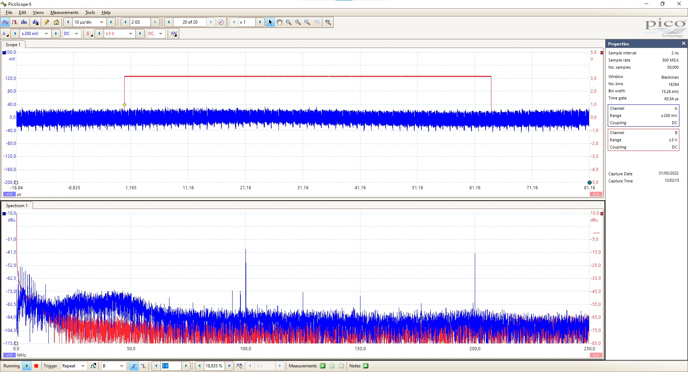

# Master_thesis

This folder will group all the ressources needed to replicate the attacks performed during my master's thesis at the University of Radboud (Nijmegen). This thesis will end my 3-year-long journey at the Ecole Centrale de Lyon (Ecully).

<div align="center">

</div>

The preliminary report written to introduce the subject to my supervisors at ECL can be found [here](Preliminary_report.pdf)

The main focus of this thesis is to recover hyperparameters and weights of a Neural Network implemented on a Xilinx zcu104 through Side Channel Attacks.

## Setup the Board

[Xilinx Tutorial](https://github.com/Xilinx/Vitis-AI) will walk you through the setup of Vitis AI on the board which allows users to easily run NN on the FPGA.

The embedded CPU will run PetaLinux as RTOS or Bare Metal are not available for the Deep Processing Unit (DPU) IP on this board yet.

Vitis AI has the ability to run any Network which has been developped with [Pytorch](https://github.com/Xilinx/Vitis-AI-Tutorials/tree/master/Design_Tutorials/09-mnist_pyt), Tensorflow or Caffe. Once converted and implemented on the board, [Vitis AI Runtime](https://github.com/Xilinx/Vitis-AI/tree/master/demo/VART) allows the user to controll the execution via python or C++ API.

The image given by Xilinx for the evaluation board does not allow GPIOs access. To enable them, a new image must be build. [GPIO_trigger_setup](./GPIO_trigger_setup.md) will guide you through the process of building the image and explain how to use the GPIOs as a trigger. The modified image allowing DPU use and GPIOs access can be found in the [platform_files](./platform_files) folder


## Preliminary results

After changing the Clock frequencies given to the DPU (100 and 200 MHz instead of 300 and 600MHz) for easier measurements, the first measurements show an activity of the DPU at 100Mhz when an application is running. Two applications have been tested including a resnet50 image recognition network and a 3-4-and 5 layer CNN trained on the MNIST dataset. These two examples come from the Vitis Tutorial Library. 

The measuring setup is the following :
<div align="center">

</div>

The ZCU104 communicates through USB with TeraTerm and the Picoscope also uses USB to communicate with the PC. The trigger wire (linked to the LED) is plugged on the B channel of the scope and the RF-U 2,5-2 probe to the A channel through the PA303 amplifier. After some measurements, the probe has been aimed at the capacitor located on Y16 on the back of the board. 

### MNIST example

The networks trained on the MNIST dataset allow fast inferences (<50ms). On the following figure, the trigger is set high before the dpu.execute_async() command and set low after the dpu.wait(). This allows to identify the limits of the DPU activity. 

<div align="center">

</div>

The graph shows a peak of activity within the trigger. The spectrum shows a lot of low frequency (<40MHz) noise and a apike at 100MHz which is one of the clocks entering the DPU. The following graphs show the background noise (probe in the air) and the signal when the DPU is not working : just the trigger is running.

<div align="center">

</div>

The intensity of the 100MHz peak does not change when the DPU is running or not but it disapears on the background noise. The peaks around 100MHz shared on tall the graphs seems to be local radio stations (Oranje Radio 94,2 MHz). 

Zooming on the peak observed on the first graph shows interesting features. It shows frequency peaks around 100 and 200 MHz which corresponds to the frequencies of the running DPU and it shows some patterns which could be identified as computing layers. The following graphs show no activity from the DPU against the DPU running the MNIST classification on a different timescale than previously shown.

<div align="center">

</div>

To confirm that the patterns oberved on the Scope of the 5 layer CNN, a 4-layer, a 3-layer, and a bigger 5-layer  CNN were implemented. To precisely record the activity of the layers. The following graphs show the envelope of the trace averaged on 10k traces for the 3, 4 and 5-layer CNN.

<div align="center">

</div>

Here are the Pytorch architectures of the 3 CNNs :
```
## Layer 1
nn.Conv2d(1,16, kernel_size=5, stride=2, padding=1)
nn.BatchNorm2d(16)
nn.ReLU(inplace=True)

## Layer 2
nn.Conv2d(16,32, kernel_size=5, stride=2, padding=1)
nn.BatchNorm2d(32)
nn.ReLU(inplace=True)

##Only for the 3_layer
nn.Conv2d(32,10, kernel_size=3, stride=3, padding=1)

## Only for the 4_Layer 
nn.Conv2d(32, 64, kernel_size=3, stride=2, padding=1)
nn.BatchNorm2d(64)
nn.ReLU(inplace=True)
nn.Conv2d(64, 10, kernel_size=3, stride=3, padding=1)

## Only for the 5_Layer
nn.Conv2d(32, 64, kernel_size=3, stride=2, padding=1)
nn.BatchNorm2d(64)
nn.ReLU(inplace=True)
nn.Conv2d(64, 90, kernel_size=3, stride=1, padding=1)
nn.BatchNorm2d(90)
nn.ReLU(inplace=True)
nn.Conv2d(90, 10, kernel_size=3, stride=3, padding=1)


nn.BatchNorm2d(10)
nn.Flatten
```

Considering the capabilities of the DPU unit which are shown on the Table of the [Vitis AI Doc](https://docs.xilinx.com/r/en-US/pg338-dpu/Architecture-of-the-DPUCZDX8G). The DPU unit can paralalize 16 channels on inputs and outputs. This means that the 3-layer CNN has 5 Convollution layers to compute : 1rst one is fully parallel, second and third one are executed in 2 batches.

Convolution Layers appera to be distributed in different peaks. The blue peaks at the beginning of the traces are due to misalignement of the traces due to bad trigger tuning.

In order to understand the different peaks, many networks have been implemented and their traces have been recorded. The following architecture has been used : 

```
## Layer 1
nn.Conv2d(1,16, kernel_size=5, stride=2, padding=1)
nn.BatchNorm2d(16)
nn.ReLU(inplace=True)

## Layer 2
nn.Conv2d(16,**32**, kernel_size=5, stride=2, padding=1)
nn.BatchNorm2d(**32**)
nn.ReLU(inplace=True)

## Layer 3
nn.Conv2d(**32**,10, kernel_size=3, stride=3, padding=1)

nn.BatchNorm2d(10)
nn.Flatten
```

The **32** values have been tested for 16, 32 and 64 channels in order to see the impact of the number of channels on the EM traces. The three following images show the results.

<div align="center">

</div>

The difference is clearly visible and can be explained by the parallelisation. The smallest network (16) has just enough channel for the DPU unit to do it all at once when the **32** and **64** need multiple iterations: 2 and 4 respectivelly.

### Number of operation / layer

The execution time of each layer should be linked to the number of operation done during this layer. If *p_in* and *p_out* are the pixel size of the input and output square images, *k* is the kernel size, *c_in* and *c_out* the number of input/output channels, *s* is the stride and *p* the padding of the convolution layer. The input and output size image are linked :
*p_out* = (*p_in* - *k* + 2 * *p*) / *s*

The number of operations can be expressed as follows : *n_ops* = *p_out*² * *k*² * *c_out* * *c_in*
And the time of execution : *t* = *n_ops* / *clk* / *parallelisation*
with *clk* being the clock of the DPU unit and *parallelisation* the number of operations/clk cycle 

The following graphs show the theoretical and measured execution time of different layers with different *p_out* for two different *k* and with different ranges.

<div align="center">

</div>

Even though the results do not fit perfectly, there is a clear link between output size and execution time. Further tests show that these results degrade when the output size becomes really small (<28).

### Neural Network to reverse engineer

The use of machine learning in SCA has been increasing with the popularity and knowledge around it. Several Neural Networks have been implemented to try and recover the different parameters of the application running on the FPGA. 

#### Size of layer

The first one implemented is based on the network used to link the execution time and the number of operations. Using a kernel size of 5 and because the amount of parallelisation is constant, the network can be based on the output feature size. Using a python script to convert the TRS files into a bunch of *peaks.csv* files, training and testing sets are created containing 80 and 20% of the data. In order to deal with the varying length of the input (because the peaks are different length, 0-padding is added at the end of the traces to make them fixed length.

The network is 1 convolution layer followed by 2 FC layers. After a few epochs, the network is able to classify the inputs into 10 classes traces with close to 100% accuracy. This task is quite easy as the previous graph has shown that execution time is strongly linked to number of operations (ie feature size) and the different classes don't overlap at all. 

A discussion could be opened about the padding. It might be that the network only base its output on the length of the 0 padding.
